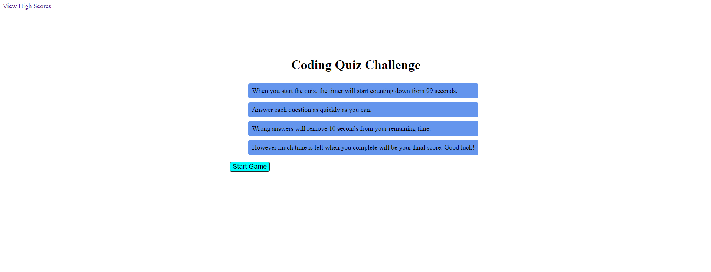

# Code Quiz

A relatively simple quiz on basic Javascript concepts

## Acceptance Criteria

Given that you are taking a code quiz:
When you click the start button,
then a timer starts and you are presented with a question.
When you answer a question,
then you are presented with another question.
When you answer a question incorrectly,
then time is subtracted from the clock.
When all questions are answered or the timer reaches 0,
then the game is over.
When the game is over,
then you can save your initials and score.

The following screenshot demonstrates the application functionality:

